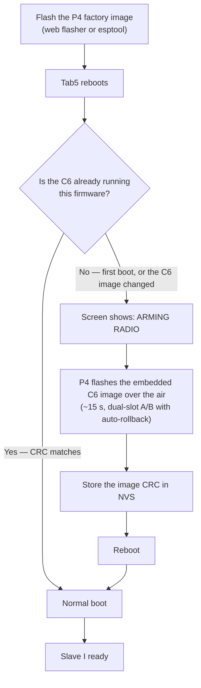

# Installing Slave I

The M5Stack Tab5 has two chips, and Slave I ships firmware for both:

- **ESP32-P4** — the application (UI, orchestration, storage). Flashed over USB-C.
- **ESP32-C6** — the radio engine. Not reachable by cable on the Tab5.

You **flash once** (the P4). The C6 firmware is bundled inside the P4 image and is
flashed automatically, over the air, on the first boot. There is no second step and
no microSD required.

## How installation works



The C6 provisioning runs **once**: the P4 records the flashed image's CRC in NVS, so
every later boot skips it and goes straight to normal operation. It runs again only
after a firmware update that changes the C6 image.

## Flash the P4

### Option A — Web flasher (easiest)

Open the web flasher at **https://0day1day.github.io/Slave_I/** in Chrome or Edge
on desktop, connect the Tab5 by USB-C, and click *Install*. It pulls the firmware
from the latest GitHub release.

Requires a browser with Web Serial (Chrome / Edge, desktop).

### Option B — esptool (any OS)

Download `slave-i-v0.1.0-p4-factory.bin` from the
[latest release](https://github.com/0day1day/Slave_I/releases/latest), then:

```bash
pip install esptool
esptool --chip esp32p4 -p <PORT> write_flash 0x0 slave-i-v0.1.0-p4-factory.bin
```

`<PORT>` is e.g. `/dev/cu.usbmodem1101` (macOS), `/dev/ttyACM0` (Linux) or `COMx`
(Windows). The factory image is self-contained (bootloader + partition table + app,
with the C6 image embedded).

## First boot

The first boot shows an **ARMING RADIO** screen with a spinner for ~15 s while the
P4 provisions the C6, then the Tab5 reboots once into Slave I. This is expected —
don't unplug during it. Serial shows `[c6-ota] C6 provisioned OK`. If provisioning
ever fails, the Tab5 still boots and retries on the next boot (the status bar shows
`C6 --` until the radio is up).

## Build from source

```bash
./scripts/bootstrap.sh
./scripts/build-c6.sh      # C6 radio firmware -> network_adapter.bin (embedded in the P4)
./scripts/build-tab5.sh    # P4 application
./scripts/flash-tab5.sh    # flash the P4
```

See [`README.md`](README.md) for details.

## Troubleshooting

- **Touchscreen unresponsive right after flashing** — press the reset button (or
  power-cycle) once. Flashing over USB resets the P4 in a way that doesn't always
  re-init the GT911 touch controller; a clean reset fixes it. One-time, only after
  a flash.
- **Port disappears mid-flash** — unplug/replug the USB-C and retry.
- **Web flasher can't see the device** — use Chrome/Edge on desktop, close any
  serial monitor holding the port, try a different cable/port.
- **Radio features dead** — the first-boot C6 provisioning may not have completed;
  reboot and watch for the ARMING RADIO screen. The status bar shows `C6 --` until
  the C6 is provisioned.
