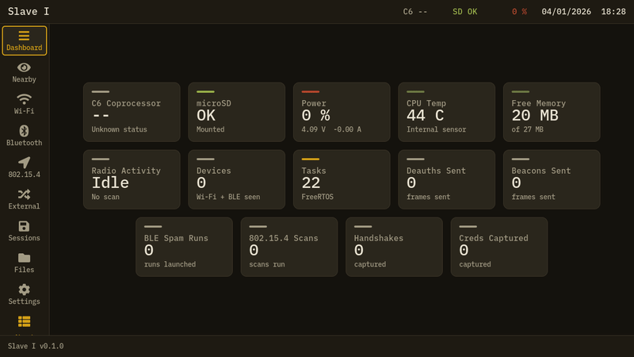

# Slave I

**Offensive-security firmware for the M5Stack Tab5.** Wireless research toolkit
for the ESP32-P4 (UI) + ESP32-C6 (radio) platform — Wi-Fi, BLE and 802.15.4 recon
and attack tooling with a touch UI, a physical-keyboard workflow, and a desktop
emulator for development.

> Slave I v0.1.0 · built on M5Stack's M5Tab5-UserDemo · [idiotsandwich.club](https://idiotsandwich.club)

<p align="center">
  
</p>

---

## ⚠️ Legal & ethical use

Slave I is a **security-research and education** tool. Use it **only** on networks
and devices you own or are **explicitly authorized** to test.

Transmitting deauthentication frames, running rogue access points, or capturing
traffic without authorization is **illegal in most jurisdictions**. You are solely
responsible for what you do with this firmware. The authors provide it "as is",
with no warranty and accept no liability.

Real talk: don't be a caraculo or a scriptkiddie.

---

## Hardware

- **M5Stack Tab5** — ESP32-P4 (application + LVGL UI) with an on-board **ESP32-C6**
  radio reached over Espressif's `esp_hosted` link (SDIO).
- **microSD** card (captures, logs, portal templates).
- Optional: M5 I2C smart keyboard or a USB HID keyboard (both drive UI navigation).

## Features

**Implemented & tested on hardware:**

- **Wi-Fi** — 2.4/5 GHz scan, Evil Twin, deauth, captive portals (built-in
  templates + custom ones from SD), handshake / EAPOL capture to `.pcap`.
- **BLE** — scan with vendor resolution (company-ID + OUI database).
- **Nearby** — unified Wi-Fi + BLE radar sorted by signal.
- **802.15.4 / Zigbee** — energy scan, device sniffer (PAN, EUI-64, vendor, type,
  LQI), raw frame capture to `.pcap` (openable in Wireshark), all-channel hop mode.
- **File manager** — browse / create / delete / copy / cut / paste on SD, plus a
  built-in text editor.
- **System** — RTC date/time (persistent), structured SD logging, live KPIs,
  themes, physical-keyboard navigation.
- **Desktop emulator** — the whole UI runs on your machine (LVGL/SDL) for fast iteration.

**Planned — gated on community interest:**

- **Sub-GHz (CC1101), 2.4 GHz NRF24, NFC and IR** — via the **ULTRA** expansion board.
  The PCB is **already designed**; I'll **produce it and ship the firmware support if
  there's community interest**. If you'd use it, say so on the repo — that's what
  decides whether it gets built.
- ESP-NOW tooling.

> The **RF / NFC / IR** entries in the UI are honest placeholders until the ULTRA
> board exists — shown for transparency, not sold as working.

## Install

**Flash once from your browser:** open the **[web flasher](https://0day1day.github.io/Slave_I/)**
in Chrome or Edge, connect the Tab5 by USB-C, and click *Install*. That's the whole
install — the ESP32-C6 radio firmware is bundled in the P4 image and provisions
itself automatically on the first boot (an *ARMING RADIO* screen for ~15 s, then one
reboot). No microSD, no second step.

Prefer a cable? Use `esptool` with the release `*-p4-factory.bin`. Full guide and a
diagram of the flow in **[INSTALL.md](INSTALL.md)**.

Binaries are attached to each [GitHub release](https://github.com/0day1day/Slave_I/releases).

## Build from source

Requirements: CMake ≥ 3.24, SDL2 (`brew install sdl2` on macOS), Python 3.11+,
and **ESP-IDF 5.4.2** (only for the on-device build).

```bash
./scripts/bootstrap.sh        # fetch vendored deps (LVGL, json)

# Desktop emulator (no hardware needed):
./scripts/build-desktop.sh
./scripts/run-desktop.sh      # or ./scripts/dev-desktop.sh to watch+rebuild

# On-device (Tab5):
./scripts/build-tab5.sh
./scripts/flash-tab5.sh       # flashes the P4
./scripts/deploy-c6.sh        # OTA-flashes the C6 radio firmware

./scripts/test.sh             # unit tests
```

## Architecture

Slave I splits work across two chips: the **P4** runs the UI and orchestrates,
the **C6** runs a native radio engine and executes attacks, driven over an RPC
protocol on the hosted link. The C6 firmware is embedded in the P4 image and
auto-provisioned over the air on the first boot.

## License & credits

MIT — see [`LICENSE`](LICENSE). Slave I is built on M5Stack's M5Tab5-UserDemo
and other open-source work; see [`CREDITS.md`](CREDITS.md) for full attribution.
